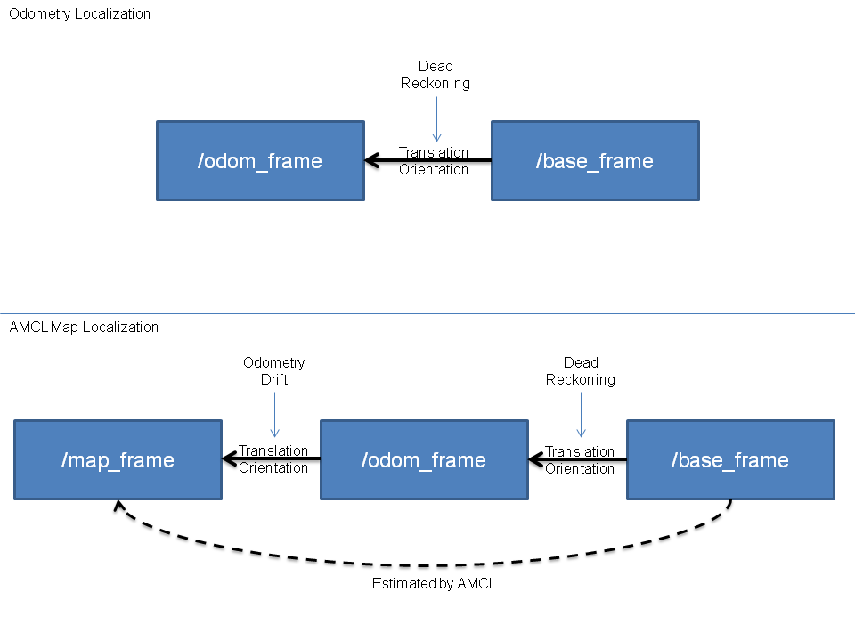

# 1.amcl简介

AMCL(adaptive Monte Carlo Localization) 是用于2D移动机器人的概率定位系统，它实现了自适应（或KLD采样）蒙特卡洛定位方法，可以根据已有地图使用粒子滤波器推算机器人位置。

amcl已经被集成到了navigation包，navigation安装前面也有介绍，命令如下:

    sudo apt install ros-<ROS版本>-navigation

# 2.amcl节点说明
## 3.1订阅的Topic
### scan(sensor_msgs/LaserScan)

    激光雷达数据。

### tf(tf/tfMessage)

    坐标变换消息。

### initialpose(geometry_msgs/PoseWithCovarianceStamped)

    用来初始化粒子滤波器的均值和协方差。

### map(nav_msgs/OccupancyGrid)

    获取地图数据。

## 3.2发布的Topic
### amcl_pose(geometry_msgs/PoseWithCovarianceStamped)

    机器人在地图中的位姿估计。

### particlecloud(geometry_msgs/PoseArray)

    位姿估计集合，rviz中可以被 PoseArray 订阅然后图形化显示机器人的位姿估计集合。

### tf(tf/tfMessage)

    发布从 odom 到 map 的转换。

## 3.3服务

### global_localization(std_srvs/Empty)

    初始化全局定位的服务。

### request_nomotion_update(std_srvs/Empty)

    手动执行更新和发布更新的粒子的服务。

### set_map(nav_msgs/SetMap)

    手动设置新地图和姿态的服务。

## 3.4调用的服务

### static_map(nav_msgs/GetMap)

    调用此服务获取地图数据。

## 3.5参数(部分)

### ~odom_model_type(string, default:"diff")

    里程计模型选择: "diff","omni","diff-corrected","omni-corrected" (diff 差速、omni 全向轮)

### ~odom_frame_id(string, default:"odom")

    里程计坐标系。

### ~base_frame_id(string, default:"base_link")

    机器人极坐标系。

### ~global_frame_id(string, default:"map")

    地图坐标系。

## 3.6坐标变换

里程计本身也是可以协助机器人定位的，不过里程计存在累计误差且一些特殊情况时(车轮打滑)会出现定位错误的情况，amcl 则可以通过估算机器人在地图坐标系下的姿态，再结合里程计提高定位准确度。

    里程计定位:只是通过里程计数据实现 /odom_frame 与 /base_frame 之间的坐标变换。
    amcl定位: 可以提供 /map_frame 、/odom_frame 与 /base_frame 之间的坐标变换。

# 3.amcl使用
## 3.1编写amcl节点相关的launch文件
关于launch文件的实现，在amcl功能包下的example目录已经给出了示例，可以作为参考

    roscd amcl
    ls examples

该目录下会列出两个文件: amcl_diff.launch 和 amcl_omni.launch 文件，前者适用于差分移动机器人，后者适用于全向移动机器人，可以按需选择，此处参考前者，新建 launch 文件，复制 amcl_diff.launch 文件内容并修改：见amcl_demo.launch

## 3.2编写测试launch文件
amcl节点是不可以单独运行的，运行 amcl 节点之前，需要先加载全局地图，然后启动 rviz 显示定位结果，上述节点可以集成进launch文件，内容见amcl.launch

## 3.3执行

1.先启动 Gazebo 仿真环境(此过程略)；

2.启动键盘控制节点：

    rosrun teleop_twist_keyboard teleop_twist_keyboard.py

3.启动上一步中集成地图服务、amcl 与 rviz 的 launch 文件；

4.在启动的 rviz 中，添加RobotModel、Map组件，分别显示机器人模型与地图，添加 posearray 插件，设置topic为particlecloud来显示 amcl 预估的当前机器人的位姿，箭头越是密集，说明当前机器人处于此位置的概率越高；

5.通过键盘控制机器人运动，会发现 posearray 也随之而改变。

