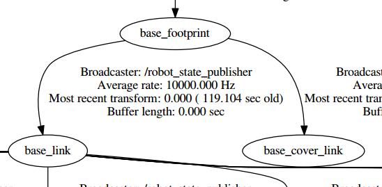

TF(TransForm)，就是坐标转换，包括了位置和姿态两个方面的变换。注意区分坐标转换和坐标系转换。

    坐标转换是一个坐标在不同坐标系下的表示，而坐标系转换不同坐标系的相对位姿关系。
ROS中机器人模型包含大量的部件，每一个部件统称之为link（比如手部、头部、某个关节、某个连杆）,每一个link上面对应着一个frame（坐标系）, 用frame表示该部件的坐标系，frame和link是绑定在一起的。

ROS中是通过右手坐标系统来标定物体。
## 含义
TF是一个通俗的名称，实际上它有很多含义：

    1、可以被当做是一种标准规范，这套标准定义了坐标转换的数据格式和数据结构．tf本质是树状的数据结构，即"tf tree"。
    2、tf也可以看成是一个话题/tf，话题中的消息保存的就是tf tree的数据结构格式。维护了整个机器人的甚至是地图的坐标转换关系。维持并更新机器人整个坐标系的话题是/tf，/tf话题表示的内容是整个机器人的tf树，而非仅仅是某两个坐标系的转换关系，这样的话，/tf话题是需要很多的节点来维护的，每一个节点维护两个frame之间的关系。
    3、tf还可以看成是一个package,它当中包含了很多的工具．比如可视化，查看关节间的tf,debug tf等等．
    4、tf含有一部分的API接口，用来节点程序中的编程。TF对发布器与订阅器进行了封装，使开发者通过TF的接口更加简单地建立对TF树中某些坐标系转换关系的维护与订阅。

tf是一个树状结构，维护坐标系之间的关系，靠**话题通信机制**来持续地发布不同link之间的坐标关系。作为树状结构，要保证父子坐标系都有某个节点在持续地发布他们之间的位姿关系，才能使树状结构保持完整。只有父子坐标系的位姿关系能被正确的发布，才能保证任意两个frame之间的连通。

如果出现某一环节的断裂，就会引发error系统报错．所以完整的tf tree不能有任何断层的地方（必须连同），这样我们才能查清楚任意两个frame之间的关系。

每两个相邻frame之间靠节点发布它们之间的位姿关系，这种节点称为broadcaster。broadcaster就是一个发布器publisher,如果两个frame之间发生了相对运动，broadcaster就会发布相关消息。


## TF树的结构

TF库的目的是实现系统中任一个点在所有坐标系之间的坐标变换。也就是说，只要给定一个坐标系下的一个点的坐标，就能获得这个点在其他任意坐标系的坐标。

为了达到上述目的，就需要提供当前ROS系统的中任意两个坐标系的位姿变换关系。

那么TF是用什么方式来描述与记录任意两个坐标系的位姿变换关系的呢？

    这里存在一个问题。假设有n个坐标系，那么他们之间的组合关系有c（n，2）个。如果这样穷举个数会非常多，所以不会采用这个方法。

为了更合理、更高效地表示任意坐标系的变换关系。TF使用多层多叉树的形式来描述这个这个ROS系统的坐标系，树中的每一个节点都是一个坐标系。TF树的特点是每个节点只要一个父节点，即采用每个坐标系都有一个父坐标系，可以有多个子坐标系的原则。

## TF坐标系表示规范

每个坐标系都有一个父坐标系，可以有多个子坐标系。TF树就是以父子坐标系的形式来组织的，最上面是父坐标系，往下是子坐标系。

在TF树中具有父子关系的坐标系是相邻的，用带箭头的线连接起来。在TF树中用箭头表示这种父子关系



上图所表示的TF树中base_link坐标系是base_footprint的子坐标系，base_cover_link坐标系也是base_footprint的子坐标系。

描述规范：
source、target frame是在进行坐标变换时的概念，source是坐标变换的源坐标系，target是目标坐标系。这个时候，这个变换代表的是 坐标变换 。
parent、child frame是在描述坐标系变换时的概念，parent是原坐标系，child是变换后的坐标系，这个时候这个变换描述的是坐标系变换，也是child坐标系在parent坐标系下的描述。
a frame到b frame的坐标系变换（frame transform），也表示了b frame在a frame的描述，也代表了把一个点在b frame里坐标变换成在a frame里坐标的坐标变换。
从parent到child的坐标系变换（frame transform）等同于把一个点从child坐标系向parent坐标系的坐标变换，等于child坐标系在parent frame坐标系的姿态描述。


## TF树的通信方式与TF树的具体表示

TF树的建立和维护是基于Topic通信机制的。

根据TF树的原理，它是靠建立与维护每个父子坐标系的变换关系来维护整个系统的所有坐标系的变换关系的。每个parent 坐标系到child坐标系变换关系是靠被称为broadcastor的发布器节点来持续发布的。

虽然是靠Topic通信机制发布的parent 坐标系到child坐标系的变换，但并不是让每一对父子坐标系都发布一个话题，实际上发布的唯一个话题是/topic，该话题集合了所有发布的父子坐标系的变换关系。

也就是说TF机制并不是让每一对父子坐标系都发布一个话题，而是将所有的父子坐标系都集合到到一个话题上，该话题的消息中传递的数据是所有父子坐标系的变换关系，是父子坐标系变换关系的一个大数组。

使用tf的tflisener就可以监听从任意两个坐标系的变换。前提是TF的树上能把这两个联通。


## TF树的建立

在开始建立TF树的时候需要指定第一个父坐标系（parent frame）作为最初的坐标系。比如机器人系统中的map坐标系。

在第一次发布一个从已有的parent frame到新的child frame的坐标系变换时，这棵树就会添加一个树枝，之后就是维护。

TF树的建立和维护靠的是tf提供的tfbroadcastor类的sendtransform接口。

transformBroadcaster()类就是一个publisher,而sendTransform的作用是来封装publish的函数。

## TF树的维护

在运行过程中要不断更新已有的parent frame到已有的child frame的坐标系变换，从而保证最新的位姿转换关系。

作为树状结构，要保证父子frame都有某个节点在持续地发布这两个frame之间的位姿关系，才能使树状结构保持完整。只有每一个父子的frame的位姿关系能被正确的发布，才能保证任意两个frame之间的连通。

## TF树的使用

一旦正常的建立一个TF树，保证每个父子坐标系都能得到正常的维护，那么就可以利用TF提供的订阅器，订阅任意两个坐标系的转换关系。

如何根据TF树得到任意坐标系的转换关系？

如果想要获得任意两个坐标系的转换关系，其实订阅器是收取的/tf话题上的消息，该消息集合了所有发布的父子坐标系的变换关系。订阅器接收的其实是当前时刻的整个TF树，然后搜索这棵树，根据不同的父子坐标系关系找到一条变换的路径。这条变换路径就能通过父子关系通路连接起所求的这两个坐标系，从而通过不断将该通路上的变换矩阵相乘得到最终的所求的这两个坐标系的变换关系。

    TF对发布器与订阅器进行了封装，使开发者通过TF的接口更加简单地建立对TF树中某些坐标系转换关系的维护与订阅。用tf的tflisener监听某一个指定的从一个a frame到b frame的变换即可。

## 总结
基本原理是，tfbroadcastor的类里有个publisher，tflisener的类里有个subscriber，前者发布叫/tf的topic，后者订阅这个topic，传送的消息message里包含了每一对parent frameid和child frameid的信息。这个机制意味着，所有的tfbroadcastor会发布某一特定的parent到child的变换，而所有tflisener会收到所有的这些变换，然后tflisener利用一个tfbuffercore的数据结构维护一个完整的树结构及其状态。基于此，tflisener在使用这棵树时，会用lookuptransform或waitfortransform来获得任意坐标系之间的变换。

这样即使只要是一个tflisener（即只监听两个坐标系的变换关系），就要跟所有tfbroadcastor建立连接，就要收取/tf上的整个TF树，还要负责搜索这棵树，找到一条变换的路径，然后通过变换矩阵相乘得到两个坐标系最终的变换关系。

## TF的特点

### 优点：

    各种数值计算的细节，你不用考虑，tf库可以帮你
    接口很简洁，会广播和监听就行；
    问题找的很准，那就是需要维护坐标系之间的关系，尤其是父子坐标系的关系
    提供了很多工具程序
    考虑了与时间相关的变换
    支持tf-prefix，可以在多机器人上用。通过让不同机器人使用不同的prefix，来区分机器人。如果只有一个机器人一般是使用/

### 缺点：

    树的结构很简单，但有时候很笨拙。对于同级的坐标系，就需要从下到上找共同先辈，然后从这个先辈再往下找，进而确定二者的关系。
    每个订阅器要想获得某两个坐标系的关系都要搜索同一颗树，这样的开销太大，主要是网络传输的负荷比较大。
    很难满足实时性的要求，这一点比较显然。这也是为什么TF会将每个变换存10秒钟的数据
    虽然整体比较容易上手但是很多细节不易理解。比如，now（）和time（0）；比如，技术文档里的一些术语名词；比如，采用了机器人里的习惯，与飞行器，惯导，车辆里的习惯区别较大，使用时不能想当然。

## TF消息：两个frame之间的消息

每个父子坐标系之间都会有broadcaster节点来发布消息维系坐标之间的转换关系。TransformStampde.msg就是/tf话题上消息。该消息格式用来表示两个frame之间一小段tf变换的相对坐标关系的。

说明：

ROS中实际上是靠TF tree来表示整个系统的坐标系关系的，而非简单地靠多个两两父子坐标系的转换关系来描述的。这里的TransformStampde.msg消息的TF tree消息类型的片段即其中的一对父子坐标系位姿的描述方式，TF tree消息类型基于TransformStampde.msg消息，因此先介绍TransformStampde.msg。TransformStampde.msg本质上描述的是TF tree中一小段tf变换。

命令行键入 rosmsg info geometry_msgs/TransformStamped

具体消息类型如下：
geometry_msgs/TransformStamped（可见该消息类型是属于geometry_msgs程序包的，而非tf包）
```
    std_msgs/Header header                     #头信息
    uint32 seq                                #|-- 序列号
    time stamp                                #|-- 时间戳
    string frame_id                            #|-- 坐标 ID
    string child_frame_id                    #子坐标系的 id
    geometry_msgs/Transform transform        #坐标信息
    geometry_msgs/Vector3 translation        #偏移量
        float64 x                                #|-- X 方向的偏移量
        float64 y                                #|-- Y 方向的偏移量
        float64 z                                #|-- Z 方向上的偏移量
    geometry_msgs/Quaternion rotation        #四元数
        float64 x                               
        float64 y                               
        float64 z                               
        float64 w
```
消息解释：

该消息表示的的是当前坐标系frame_id和它的子坐标系child_frame_id之间的转换关系。具体的转换位姿是由geometry_msgs/Transform消息类型来定义的，该消息类型用三维向量表示平移，用四元组表示旋转。


## TF消息：TF树的消息类型

/tf话题表示的内容是整个机器人的tf树，而非仅仅是某两个坐标系的转换关系，这样的话，/tf话题是需要很多的节点来维护的，每一个节点维护两个父子frame之间的关系。即一个/tf话题上面，可能会有很多个node向上面发送消息。

这样就相当于TF tree是由很多的frame之间TF拼接而成。刚才说的TransformStampde.msg消息类型表示的是两个frame之间TF关系，接下来要介绍真正在/tf话题上进行传输的TF tree的消息类型。

在tf2中的TF树对应的消息类型是tf2_msgs/TFMessage.msg。可见该消息位于tf2_msgs程序包内。

tf2_msgs/TFMessage消息的具体格式：
    geometry_msgs/TransformStamped[] transforms
            std_msgs/Header header
                    uint32 seq
                    time stamp
                    string frame_id
            string child_frame_id
            geometry_msgs/Transform transform
                    geometry_msgs/Vector3 translation
                            float64 x
                            float64 y
                            float64 z
                    geometry_msgs/Quaternion rotation
                            float64 x
                            float64 y
                            flaot64 z
                            float64 w

可以看出TF树的消息类型实际上就是一个TransformStamped类型定义的可变长度数组。也就是说本质就是由很多个两个frame之间的TF消息TransformStamped形成描述整个机器人的TF树的消息类型tf2_msgs/TFMessage.msg


## TF消息：某个坐标系内坐标点的信息
传输某个坐标系内坐标点的信息
geometry_msgs/PointStamped
命令行键入：rosmsg info geometry_msgs/PointStamped

```
    std_msgs/Header header                    #头
    uint32 seq                                #|-- 序号
    time stamp                                #|-- 时间戳
    string frame_id                            #|-- 所属坐标系的 id
    geometry_msgs/Point point                #点坐标
    float64 x                                    #|-- x y z 坐标
    float64 y
    float64 z
 ```

 
## TF在roscpp与rospy中的接口

无论是roscpp中还是rospy中都有TF库，TF提供了很多有用的接口。这里只大体描述，具体使用的时候再参考具体的资料。

提供的结构种类：

    数据类型的定义（类）：向量、点、四元数、3*3旋转矩阵、位姿等
    数据转换1：给出了旋转矩阵、四元数、欧拉角、旋转轴之间的转换函数
    关于点、向量、角度、四元数等的运算的函数
    TF类，封装好了发布器与订阅器接口。可以将坐标系转换关系发布到/tf话题上的一段transform上；也可以订阅/tf话题，并且得到到从源坐标系到目标坐标系这两个坐标系之间的转换关系。

transformBroadcaster()类就是一个publisher,而sendTransform的作用是来封装publish的函数。在实际的使用中，我们需要在某个Node中构建tf::TransformBroadcaster类，然后调用sendTransform(),将transform发布到/tf的一段transform上。

TransformListener类就是从/tf上接收的类。


## TF程序包相关的命令行使用

### 用命令行显示当前所有frame的方法：

    rosrun tf tf_monitor #显示当前坐标变换树的信息，主要是名称和实时的时间延时

    rostopic echo /tf #以TransformStamped消息类型的数组显示所有父子frame的位姿转换关系

以上主要是数据显示

### 根据当前的tf树创建一个pdf图：

     $ rosrun tf view_frames

这个工具首先订阅/tf，订阅5秒钟，根据这段时间接受到的tf信息，绘制成一张tf tree，然后创建成一个pdf图。
将会以图形的形式显示出TF树中所有的frame和两个frame 的父子关系及其Broadcaster、Average rate等

### 查看当前的tf树：

     $ rosrun rqt_tf_tree rqt_tf_tree

该命令同样是查询tf tree的，但是与第一个命令的区别是该命令是动态的查询当前的tf tree,当前的任何变化都能当即看到，例如何时断开何时连接，捕捉到这些然后通过rqt插件显示出来。

### 查看两个frame之间的变换关系：

     $ rosrun tf tf_echo[source_frame][target_frame]

将会持续的显示源坐标系和目标坐标系的位姿变换关系。

该指令可以查询任意两个frame的转换关系。


