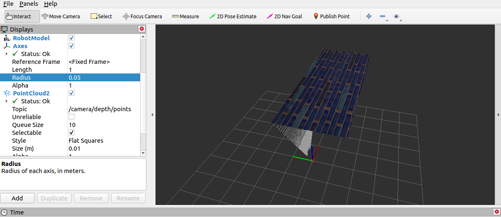

# 机器人运动控制以及里程计信息显示
## 1.ros_control 简介

场景:同一套 ROS 程序，如何部署在不同的机器人系统上，比如：开发阶段为了提高效率是在仿真平台上测试的，部署时又有不同的实体机器人平台，不同平台的实现是有差异的，如何保证 ROS 程序的可移植性？ROS 内置的解决方式是 ros_control。

ros_control:是一组软件包，它包含了控制器接口，控制器管理器，传输和硬件接口。ros_control 是一套机器人控制的中间件，是一套规范，不同的机器人平台只要按照这套规范实现，那么就可以保证 与ROS 程序兼容，通过这套规范，实现了一种可插拔的架构设计，大大提高了程序设计的效率与灵活性。

gazebo 已经实现了 ros_control 的相关接口，如果需要在 gazebo 中控制机器人运动，直接调用相关接口即可
## 2.运动控制实现流程(Gazebo)

1.创建机器人模型（见urdf/gazebo/文件夹），然后再编写一个单独的 xacro 文件（move.xacro），为机器人模型添加传动装置以及控制器

2.将此文件集成进总xacro文件（mbot_gazebo.xacro）

3.启动 Gazebo 并发布 /cmd_vel 消息控制机器人运动

move.xacro文件如下：
为joint添加传动装置及控制器
两轮差速配置
```xml
<robot name="my_car_move" xmlns:xacro="http://wiki.ros.org/xacro">

    <!-- 传动实现:用于连接控制器与关节 -->
    <xacro:macro name="joint_trans" params="joint_name">
        <!-- Transmission is important to link the joints and the controller -->
        <transmission name="${joint_name}_trans">
            <type>transmission_interface/SimpleTransmission</type>
            <joint name="${joint_name}">
                <hardwareInterface>hardware_interface/VelocityJointInterface</hardwareInterface>
            </joint>
            <actuator name="${joint_name}_motor">
                <hardwareInterface>hardware_interface/VelocityJointInterface</hardwareInterface>
                <mechanicalReduction>1</mechanicalReduction>
            </actuator>
        </transmission>
    </xacro:macro>

    <!-- 每一个驱动轮都需要配置传动装置 -->
    <xacro:joint_trans joint_name="left_wheel2base_link" />
    <xacro:joint_trans joint_name="right_wheel2base_link" />

    <!-- 控制器 -->
    <gazebo>
        <plugin name="differential_drive_controller" filename="libgazebo_ros_diff_drive.so">
            <rosDebugLevel>Debug</rosDebugLevel>
            <publishWheelTF>true</publishWheelTF>
            <robotNamespace>/</robotNamespace>
            <publishTf>1</publishTf>
            <publishWheelJointState>true</publishWheelJointState>
            <alwaysOn>true</alwaysOn>
            <updateRate>100.0</updateRate>
            <legacyMode>true</legacyMode>
            <leftJoint>left_wheel2base_link</leftJoint> <!-- 左轮 -->
            <rightJoint>right_wheel2base_link</rightJoint> <!-- 右轮 -->
            <wheelSeparation>${base_link_radius * 2}</wheelSeparation> <!-- 车轮间距 -->
            <wheelDiameter>${wheel_radius * 2}</wheelDiameter> <!-- 车轮直径 -->
            <broadcastTF>1</broadcastTF>
            <wheelTorque>30</wheelTorque>
            <wheelAcceleration>1.8</wheelAcceleration>
            <commandTopic>cmd_vel</commandTopic> <!-- 运动控制话题 -->
            <odometryFrame>odom</odometryFrame> 
            <odometryTopic>odom</odometryTopic> <!-- 里程计话题 -->
            <robotBaseFrame>base_footprint</robotBaseFrame> <!-- 根坐标系 -->
        </plugin>
    </gazebo>

</robot>
```
集成进Xacro文件里面:

见 mbot_sensor_gazebo.launch
以下为示例
```xml
<!-- 组合小车底盘与摄像头 -->
<robot name="my_car_camera" xmlns:xacro="http://wiki.ros.org/xacro">
    <xacro:include filename="my_head.urdf.xacro" />
    <xacro:include filename="my_base.urdf.xacro" />
    <xacro:include filename="my_camera.urdf.xacro" />
    <xacro:include filename="my_laser.urdf.xacro" />
    <xacro:include filename="move.urdf.xacro" />
</robot>
```
启动launch文件：

```xml
<launch>

    <!-- 将 Urdf 文件的内容加载到参数服务器 -->
    <param name="robot_description" command="$(find xacro)/xacro $(find demo02_urdf_gazebo)/urdf/xacro/my_base_camera_laser.urdf.xacro" />
    <!-- 启动 gazebo -->
    <include file="$(find gazebo_ros)/launch/empty_world.launch">
        <arg name="world_name" value="$(find demo02_urdf_gazebo)/worlds/hello.world" />
    </include>

    <!-- 在 gazebo 中显示机器人模型 -->
    <node pkg="gazebo_ros" type="spawn_model" name="model" args="-urdf -model mycar -param robot_description"  />
</launch>
```

启动 launch 文件，使用 topic list 查看话题列表，会发现多了 /cmd_vel 然后发布 vmd_vel 消息控制即可
使用命令控制(或者可以编写单独的节点控制)

    rostopic pub -r 10 /cmd_vel geometry_msgs/Twist '{linear: {x: 0.2, y: 0, z: 0}, angular: {x: 0, y: 0, z: 0.5}}'

# 雷达信息仿真

## 雷达仿真基本流程:

    1.已经创建完毕的机器人模型（有雷达），编写单独的 xacro 文件，为机器人模型中的雷达部分添加雷达配置；

    2.将此文件集成进xacro文件；

    3.启动 Gazebo，使用 Rviz 显示雷达信息。

# 摄像头信息仿真以及显示

通过 Gazebo 模拟摄像头传感器，并在 Rviz 中显示摄像头数据。

实现流程:

摄像头仿真基本流程:

    1.已经创建完毕的机器人模型，编写一个单独的 xacro 文件，为机器人摄像头添加摄像头配置；

    2.将此文件集成进xacro文件；

    3.启动 Gazebo，使用 Rviz 显示摄像头信息。

# kinect信息仿真以及显示 **

注意里面的“kinect link名称”，要改为与自己的模型里面的相机对应的link

        ……………
        <gazebo reference="kinect link名称">  
        ……………
            <frameName>kinect link名称</frameName>
        ……………

将此文件集成进入总xacro文件：见mbot_kinect_gazebo.xacro

启动launch文件mbot_kinect_gazebo.launch开始仿真

## 关于kinect相机点云图像飘在天上的问题
### 原因:在kinect中图像数据与点云数据使用了两套坐标系统，且两套坐标系统位姿并不一致。
解决:
1.在插件中为kinect设置坐标系，修改配置文件的<frameName>标签内容：
```xml
<frameName>support_depth</frameName>
```

2.发布新设置的坐标系到kinect连杆的坐标变换关系，在启动rviz的launch中，添加:
```xml
<node pkg="tf2_ros" type="static_transform_publisher" name="static_transform_publisher" args="0 0 0 -1.57 0 -1.57 /support /support_depth" />
```

请注意：
mbot_kinect_gazebo.launch文件中最后一行：
```xml
        <node pkg="tf2_ros" type="static_transform_publisher" name="static_transform_publisher" args="0 0 0 -1.57 0 -1.57 /base_link /support_depth" />
```
以及修改了framename这个标签（support_depth原本是camera，和相机一致）
```xml
     <frameName>support_depth</frameName>
```
如果没有前面的改动，会出现下图的问题：点云飘在天上



第二种方法：
也可以不在launch文件中发布静态坐标变换。
在xacro文件中新建一个新的link:"camera_link_optical",让它与原本的camera之间建立静态joint

```xml
    <joint name="camera_joint" type="fixed">
        <axis xyz="0 1 0" />
        <origin xyz="-0.005 0 .06" rpy="0 0 0"/>
        <parent link="pitch_platform"/>
        <child link="camera_link"/>
    </joint>

    <!-- generate an optical frame http://www.ros.org/reps/rep-0103.html#suffix-frames
        so that ros and opencv can operate on the camera frame correctly -->
    <joint name="camera_optical_joint" type="fixed">
        <!-- these values have to be these values otherwise the gazebo camera image
            won't be aligned properly with the frame it is supposedly originating from -->
        <origin xyz="0 0 0" rpy="-1.5708 0 -1.5708"/>
        <parent link="camera_link"/>
        <child link="camera_link_optical"/>
    </joint>

    <link name="camera_link_optical">
    </link>
```

然后在kinect传感器的xacro文件中，修改深度图像的frame：

    注意<gazebo reference="camera_link">该标签不需要修改）

```xml
    <frameName>camera_link_optical</frameName>
```