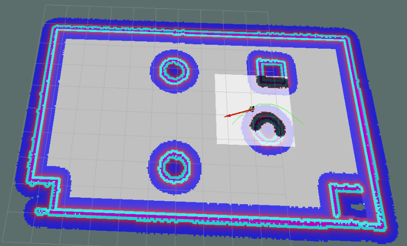

# 1.move_base简介

move_base 功能包提供了基于动作(action)的路径规划实现，move_base 可以根据给定的目标点，控制机器人底盘运动至目标位置，并且在运动过程中会连续反馈机器人自身的姿态与目标点的状态信息。move_base主要由全局路径规划与本地路径规划组成(见路径规划.md)。

move_base已经被集成到了navigation包，navigation安装前面也有介绍，命令如下:

    sudo apt install ros-<ROS版本>-navigation

# 2.move_base节点说明

move_base功能包中的核心节点是:move_base。为了方便调用，需要先了解该节点action、订阅的话题、发布的话题、服务以及相关参数。
## 2.1动作

## action动作订阅

### move_base/goal(move_base_msgs/MoveBaseActionGoal)

    move_base 的运动规划目标。

### move_base/cancel(actionlib_msgs/GoalID)

    取消目标。

## action动作发布

### move_base/feedback(move_base_msgs/MoveBaseActionFeedback)

    连续反馈的信息，包含机器人底盘坐标。

### move_base/status(actionlib_msgs/GoalStatusArray)

    发送到move_base的目标状态信息。

### move_base/result(move_base_msgs/MoveBaseActionResult)

    操作结果(此处为空)。

## 2.2订阅的Topic

### move_base_simple/goal(geometry_msgs/PoseStamped)

    运动规划目标(与action相比，没有连续反馈，无法追踪机器人执行状态)。

## 2.3发布的Topic

### cmd_vel(geometry_msgs/Twist)

    输出到机器人底盘的运动控制消息。

## 2.4服务

### ~make_plan(nav_msgs/GetPlan)

    请求该服务，可以获取给定目标的规划路径，但是并不执行该路径规划。

### ~clear_unknown_space(std_srvs/Empty)

    允许用户直接清除机器人周围的未知空间。

### ~clear_costmaps(std_srvs/Empty)

    允许清除代价地图中的障碍物，可能会导致机器人与障碍物碰撞，请慎用。

## 2.5参数

请参考官网。

# 3.move_base与代价地图

## 3.1概念

机器人导航(尤其是路径规划模块)是依赖于地图的，地图在SLAM时已经有所介绍了，ROS中的地图其实就是一张图片，这张图片有宽度、高度、分辨率等元数据，在图片中使用灰度值来表示障碍物存在的概率。不过SLAM构建的地图在导航中是不可以直接使用的，因为：

    1.SLAM构建的地图是静态地图，而导航过程中，障碍物信息是可变的，可能障碍物被移走了，也可能添加了新的障碍物，导航中需要时时的获取障碍物信息；
    2.在靠近障碍物边缘时，虽然此处是空闲区域，但是机器人在进入该区域后可能由于其他一些因素，比如：惯性、或者不规则形体的机器人转弯时可能会与障碍物产生碰撞，安全起见，最好在地图的障碍物边缘设置警戒区，尽量禁止机器人进入...

所以，静态地图无法直接应用于导航，其基础之上需要添加一些辅助信息的地图，比如时时获取的障碍物数据，基于静态地图添加的膨胀区等数据。

## 3.2组成
代价地图有两张:global_costmap(全局代价地图) 和 local_costmap(本地代价地图)，前者用于全局路径规划，后者用于本地路径规划。

两张代价地图都可以多层叠加,一般有以下层级:

    Static Map Layer：静态地图层，SLAM构建的静态地图。

    Obstacle Map Layer：障碍地图层，传感器感知的障碍物信息。

    Inflation Layer：膨胀层，在以上两层地图上进行膨胀（向外扩张），以避免机器人的外壳会撞上障碍物。

    Other Layers：自定义costmap。

多个layer可以按需自由搭配。

## 3.3碰撞算法

在ROS中，计算代价的方法如下图所示：

上图中，横轴是距离机器人中心的距离，纵轴是代价地图中栅格的灰度值。

    致命障碍:栅格值为254，此时障碍物与机器人中心重叠，必然发生碰撞；
    内切障碍:栅格值为253，此时障碍物处于机器人的内切圆内，必然发生碰撞；
    外切障碍:栅格值为[128,252]，此时障碍物处于其机器人的外切圆内，处于碰撞临界，不一定发生碰撞；
    非自由空间:栅格值为(0,127]，此时机器人处于障碍物附近，属于危险警戒区，进入此区域，将来可能会发生碰撞；
    自由区域:栅格值为0，此处机器人可以自由通过；
    未知区域:栅格值为255，还没探明是否有障碍物。

膨胀空间的设置可以参考非自由空间。

# 4.move_base使用

路径规划算法在move_base功能包的move_base节点中已经封装完毕了，但是还不可以直接调用，因为算法虽然已经封装了，但是该功能包面向的是各种类型支持ROS的机器人，不同类型机器人可能大小尺寸不同，传感器不同，速度不同，应用场景不同....最后可能会导致不同的路径规划结果，那么在调用路径规划节点之前，我们还需要配置机器人参数。具体实现如下:

    1.先编写launch文件模板
    2.编写配置文件
    3.集成导航相关的launch文件
    4.测试

**launch文件见movebase.launch**

启动了 move_base 功能包下的 move_base 节点，respawn 为 false，意味着该节点关闭后，不会被重启；clear_params 为 true，意味着每次启动该节点都要清空私有参数然后重新载入；通过 rosparam 会载入若干 yaml 文件用于配置参数，这些yaml文件的配置以及作用详见下一小节内容。

4.2配置文件

关于配置文件的编写，可以参考一些成熟的机器人的路径规划实现，比如: turtlebot3，github链接：https://github.com/ROBOTIS-GIT/turtlebot3/tree/master/turtlebot3_navigation/param，先下载这些配置文件备用。

在功能包下新建 param 目录，复制下载的文件到此目录: 

costmap_common_params_burger.yaml

local_costmap_params.yaml

global_costmap_params.yaml

base_local_planner_params.yaml

并将costmap_common_params_burger.yaml 重命名为:costmap_common_params.yaml。

配置文件修改以及解释:

    1.costmap_common_params
    该文件是move_base 在全局路径规划与本地路径规划时调用的通用参数，包括:机器人的尺寸、距离障碍物的安全距离、传感器信息等。
    2.global_costmap_params.yaml
    该文件用于全局代价地图参数设置:
    3.local_costmap_params.yaml
    该文件用于局部代价地图参数设置:
    4.base_local_planner_params.yaml
    基本的局部规划器参数配置，这个配置文件设定了机器人的最大和最小速度限制值，也设定了加速度的阈值。

### 具体内容见param文件夹

## 4.2.参数配置技巧
以上配置在实操中，可能会出现机器人在本地路径规划时与全局路径规划不符而进入膨胀区域出现假死的情况，如何尽量避免这种情形呢？

    全局路径规划与本地路径规划虽然设置的参数是一样的，但是二者路径规划和避障的职能不同，可以采用不同的参数设置策略:
    全局代价地图可以将膨胀半径和障碍物系数设置的偏大一些；
    本地代价地图可以将膨胀半径和障碍物系数设置的偏小一些。

这样，在全局路径规划时，规划的路径会尽量远离障碍物，而本地路径规划时，机器人即便偏离全局路径也会和障碍物之间保留更大的自由空间，从而避免了陷入“假死”的情形。

## 4.3launch文件集成

如果要实现导航，需要集成地图服务、amcl 、move_base 与 Rviz 等，集成文件见**all.launch**

## 4.4测试

1.先启动 Gazebo 仿真环境(此过程略)；

2.启动导航相关的 launch 文件；

3.添加Rviz组件(参考演示结果),可以将配置数据保存，后期直接调用；

全局代价地图与本地代价地图组件配置使用movebase.rviz