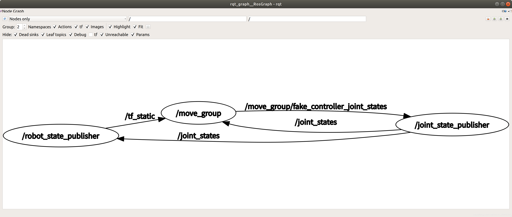
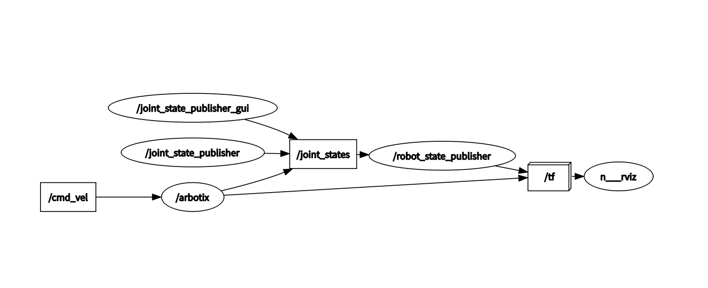

joint_state_publisher：该节点通过读取参数服务器上的/robot_description来获得机器人的所有非固定关节，并从/move_group/fake_controller_joint_states主题来获取关节状态。主要功能是负责输出关节消息（sensor_msgs/JointState）,并发布/joint_state话题到/move_group和/robot_state_publisher节点。

robot_state_publisher：接收joint_state_publisher发布的话题消息，并通过tf发布结果到/move_group节点。
